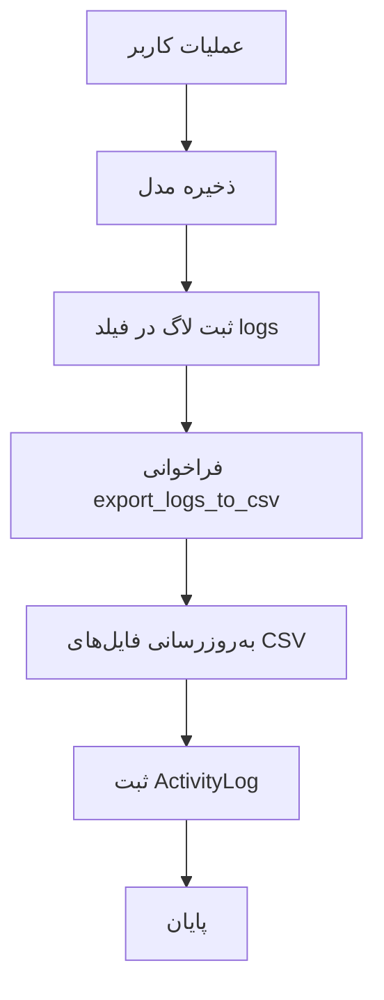

# 🔍 تحلیل جامع سیستم لاگ‌گیری و وضعیت سفارشات HomayOMS

## 📋 خلاصه اجرایی

این سند تحلیل کامل سیستم لاگ‌گیری (پایگاه داده و CSV) و وضعیت‌های سفارشات در پروژه HomayOMS را ارائه می‌دهد. تحلیل شامل مقایسه بین نسخه‌های v1 و v1.1 و ارائه پیشنهادات بهبود است.

## 🏗️ معماری سیستم لاگ‌گیری

### 📊 سیستم دوگانه لاگ‌گیری

#### 1. 📜 لاگ‌گیری پایگاه داده (ActivityLog)
```python
class ActivityLog(BaseModel):
    # 🎭 انواع عملیات (20 نوع)
    ACTION_CHOICES = [
        ('CREATE', '✅ ایجاد'),
        ('UPDATE', '📝 ویرایش'),
        ('DELETE', '🗑️ حذف'),
        ('VIEW', '👁️ مشاهده'),
        ('LOGIN', '🔑 ورود'),
        ('LOGOUT', '🚪 خروج'),
        ('EXPORT', '📤 خروجی'),
        ('IMPORT', '📥 ورودی'),
        ('APPROVE', '✅ تایید'),
        ('REJECT', '❌ رد'),
        ('PAYMENT', '💰 پرداخت'),
        ('ORDER', '🛒 سفارش'),
        ('DELIVERY', '🚚 تحویل'),
        ('CANCEL', '🚫 لغو'),
        ('RESTORE', '♻️ بازگردانی'),
        ('BACKUP', '💾 پشتیبان‌گیری'),
        ('PRICE_UPDATE', '💰 تغییر قیمت'),
        ('ERROR', '⚠️ خطا'),
        ('WARNING', '⚡ هشدار'),
        ('INFO', 'ℹ️ اطلاعات'),
    ]
    
    # ⚠️ سطوح اهمیت
    SEVERITY_CHOICES = [
        ('LOW', '🟢 کم'),
        ('MEDIUM', '🟡 متوسط'),
        ('HIGH', '🟠 بالا'),
        ('CRITICAL', '🔴 بحرانی'),
    ]
```

#### 2. 📄 لاگ‌گیری CSV (Human-Readable)
```python
# 📁 ساختار فایل‌های CSV
csv_logs/
├── customers_logs.csv      # لاگ‌های مشتریان
├── orders_logs.csv         # لاگ‌های سفارشات
└── payments_logs.csv       # لاگ‌های پرداخت‌ها
```

### 🔄 مکانیزم خودکار لاگ‌گیری

#### ✅ نسخه v1 (کامل)
```python
# در مدل Customer و Order
def save(self, *args, **kwargs):
    # ... کد لاگ‌گیری ...
    super().save(*args, **kwargs)
    # 🔄 خروجی خودکار به CSV
    try:
        call_command('export_logs_to_csv')
    except Exception:
        pass
```

#### ❌ نسخه v1.1 (ناقص)
- **فقدان فیلد logs**: مدل‌های Customer و Order فیلد logs ندارند
- **فقدان دستورات export**: دستورات export_logs_to_csv وجود ندارد
- **فقدان لاگ‌گیری خودکار**: سیستم لاگ‌گیری خودکار پیاده‌سازی نشده

## 🛒 وضعیت‌های سفارشات

### 📊 وضعیت‌های سفارش (Order Status)

```python
ORDER_STATUS_CHOICES = [
    ('Pending', '⏳ در انتظار تایید'),      # سفارش جدید
    ('Confirmed', '✅ تایید شده'),          # تایید شده توسط ادمین
    ('Processing', '🔄 در حال پردازش'),     # در حال آماده‌سازی
    ('Ready', '📦 آماده تحویل'),           # آماده برای تحویل
    ('Delivered', '🚚 تحویل داده شده'),     # تحویل شده به مشتری
    ('Cancelled', '❌ لغو شده'),           # لغو شده
    ('Returned', '↩️ مرجوع شده'),         # مرجوع شده
]
```

### 💳 روش‌های پرداخت

```python
PAYMENT_METHOD_CHOICES = [
    ('Cash', '💵 نقدی'),
    ('Terms', '📅 قسطی'),
    ('Bank_Transfer', '🏦 حواله بانکی'),
    ('Check', '📝 چک'),
]
```

### 📦 وضعیت محصولات

```python
STATUS_CHOICES = [
    ('In-stock', '📦 موجود در انبار'),
    ('Sold', '💰 فروخته شده'),
    ('Pre-order', '⏳ پیش‌سفارش'),
]
```

## 🔍 تحلیل تفاوت‌های نسخه‌ها

### ✅ نقاط قوت نسخه v1

1. **سیستم لاگ‌گیری کامل**:
   - فیلد logs در مدل‌های Customer و Order
   - دستورات export_logs_to_csv
   - لاگ‌گیری خودکار در save() methods
   - ActivityLog با GenericForeignKey

2. **سیستم پرداخت کامل**:
   - مدل Payment
   - دستورات export_payments_logs_to_csv
   - لاگ‌گیری کامل پرداخت‌ها

3. **مدیریت خطا**:
   - try-catch در لاگ‌گیری خودکار
   - عدم توقف سیستم در صورت خطا

### ❌ مشکلات نسخه v1.1

1. **فقدان سیستم لاگ‌گیری**:
   - فیلد logs در مدل‌ها وجود ندارد
   - دستورات export وجود ندارد
   - لاگ‌گیری خودکار پیاده‌سازی نشده

2. **فقدان سیستم پرداخت**:
   - مدل Payment وجود ندارد
   - لاگ‌گیری پرداخت‌ها وجود ندارد

3. **عدم سازگاری**:
   - با سیستم لاگ‌گیری موجود سازگار نیست
   - قابلیت‌های جدید بدون لاگ‌گیری

## 📊 جریان لاگ‌گیری در نسخه v1

### 🔄 فرآیند لاگ‌گیری خودکار



### 📝 نمونه لاگ‌های ثبت شده

#### Customer Logs:
```csv
customer_id,customer_name,log_line
1,مشتری تست,"2025-07-02 08:13 Created By system, 2025-07-02 08:13 پروفایل خودکار ایجاد شده برای کاربر: customer By system FOR comments,"
```

#### Payment Logs:
```csv
Payment ID,Tracking Code,Order Number,Customer Name,Gateway,Amount (Toman),Status,Logs,Created At
1,PAY-20250702-NUPSGM,ORD-20250702-1ADR,مشتری تست 1751444021.66902,💎 زرین‌پال,"332,500",🟡 آغاز شده,"2025-07-02 08:13 Payment initiated By system, 2025-07-02 08:13 Gateway: zarinpal By system, 2025-07-02 08:13 Amount: 332,500 Toman By system,",2025-07-02 08:13:42
```

## 🎯 پیشنهادات بهبود

### 1. 🔧 تکمیل سیستم لاگ‌گیری v1.1

#### الف) اضافه کردن فیلد logs
```python
# در مدل‌های Customer و Order
logs = models.TextField(
    blank=True,
    verbose_name="📝 لاگ‌های تحلیلی",
    help_text="لاگ‌های کامل تغییرات و عملیات"
)
```

#### ب) پیاده‌سازی دستورات export
```python
# ایجاد فایل export_logs_to_csv.py
from django.core.management.base import BaseCommand
from core.models import Customer, Order
import os
import csv

class Command(BaseCommand):
    help = 'Export all customer and order logs to csv_logs directory.'
    
    def handle(self, *args, **options):
        # کپی از نسخه v1
```

#### ج) اضافه کردن لاگ‌گیری خودکار
```python
# در save() methods
def save(self, *args, **kwargs):
    # ... کد موجود ...
    super().save(*args, **kwargs)
    # اضافه کردن لاگ‌گیری خودکار
    try:
        call_command('export_logs_to_csv')
    except Exception:
        pass
```

### 2. 💳 تکمیل سیستم پرداخت

#### الف) اضافه کردن مدل Payment
```python
class Payment(BaseModel):
    order = models.ForeignKey(Order, on_delete=models.CASCADE)
    tracking_code = models.CharField(max_length=50, unique=True)
    gateway = models.CharField(max_length=50)
    amount = models.DecimalField(max_digits=15, decimal_places=2)
    status = models.CharField(max_length=20, choices=PAYMENT_STATUS_CHOICES)
    logs = models.TextField(blank=True)
```

#### ب) دستور export_payments_logs_to_csv
```python
# کپی از نسخه v1
```

### 3. 📊 بهبود سیستم گزارش‌گیری

#### الف) داشبورد لاگ‌ها
```python
def activity_logs_dashboard(request):
    """📊 داشبورد لاگ‌های فعالیت"""
    logs = ActivityLog.objects.all().order_by('-created_at')[:100]
    context = {
        'logs': logs,
        'total_logs': ActivityLog.objects.count(),
        'recent_activities': logs[:10],
    }
    return render(request, 'core/activity_logs_dashboard.html', context)
```

#### ب) گزارش‌های تحلیلی
```python
def analytics_report(request):
    """📈 گزارش‌های تحلیلی"""
    # آمار سفارشات
    orders_by_status = Order.objects.values('status').annotate(count=Count('id'))
    # آمار پرداخت‌ها
    payments_by_gateway = Payment.objects.values('gateway').annotate(count=Count('id'))
    # آمار مشتریان
    customers_by_status = Customer.objects.values('status').annotate(count=Count('id'))
    
    context = {
        'orders_by_status': orders_by_status,
        'payments_by_gateway': payments_by_gateway,
        'customers_by_status': customers_by_status,
    }
    return render(request, 'core/analytics_report.html', context)
```

### 4. 🔄 بهبود جریان سفارشات

#### الف) وضعیت‌های جدید
```python
ORDER_STATUS_CHOICES = [
    ('Pending', '⏳ در انتظار تایید'),
    ('Confirmed', '✅ تایید شده'),
    ('Processing', '🔄 در حال پردازش'),
    ('Ready', '📦 آماده تحویل'),
    ('Delivered', '🚚 تحویل داده شده'),
    ('Cancelled', '❌ لغو شده'),
    ('Returned', '↩️ مرجوع شده'),
    ('Payment_Pending', '💰 در انتظار پرداخت'),  # جدید
    ('Payment_Failed', '❌ پرداخت ناموفق'),      # جدید
    ('Refunded', '↩️ بازپرداخت شده'),           # جدید
]
```

#### ب) لاگ‌گیری وضعیت‌ها
```python
def update_order_status(order, new_status, user=None):
    """🔄 به‌روزرسانی وضعیت سفارش با لاگ‌گیری"""
    old_status = order.status
    order.status = new_status
    order.save()
    
    # ثبت لاگ تغییر وضعیت
    ActivityLog.log_activity(
        user=user,
        action='UPDATE',
        description=f'🔄 تغییر وضعیت سفارش: {old_status} → {new_status}',
        content_object=order,
        severity='MEDIUM',
        extra_data={
            'old_status': old_status,
            'new_status': new_status,
            'order_number': order.order_number,
        }
    )
```

## 📋 برنامه اجرایی

### مرحله 1: تکمیل سیستم لاگ‌گیری v1.1
1. ✅ اضافه کردن فیلد logs به مدل‌های Customer و Order
2. ✅ ایجاد دستورات export_logs_to_csv
3. ✅ پیاده‌سازی لاگ‌گیری خودکار در save() methods
4. ✅ تست سیستم لاگ‌گیری

### مرحله 2: تکمیل سیستم پرداخت
1. ✅ اضافه کردن مدل Payment
2. ✅ ایجاد دستورات export_payments_logs_to_csv
3. ✅ پیاده‌سازی لاگ‌گیری پرداخت‌ها
4. ✅ تست سیستم پرداخت

### مرحله 3: بهبود گزارش‌گیری
1. ✅ ایجاد داشبورد لاگ‌ها
2. ✅ پیاده‌سازی گزارش‌های تحلیلی
3. ✅ اضافه کردن فیلترها و جستجو
4. ✅ تست گزارش‌گیری

### مرحله 4: بهینه‌سازی
1. ✅ بهبود عملکرد لاگ‌گیری
2. ✅ اضافه کردن ایندکس‌های بهینه
3. ✅ پیاده‌سازی پاک‌سازی خودکار لاگ‌های قدیم
4. ✅ تست نهایی

## 🎯 نتیجه‌گیری

سیستم لاگ‌گیری HomayOMS در نسخه v1 بسیار کامل و پیشرفته است، اما نسخه v1.1 فاقد این قابلیت‌ها است. با پیاده‌سازی پیشنهادات ارائه شده، می‌توان سیستم لاگ‌گیری کامل و کارآمدی ایجاد کرد که هم برای تحلیل‌های فنی و هم برای گزارش‌های تجاری مناسب باشد.

**🔑 نکته کلیدی**: حفظ سازگاری با سیستم موجود و استفاده از الگوهای اثبات شده نسخه v1 برای اطمینان از پایداری و قابلیت اطمینان سیستم. 